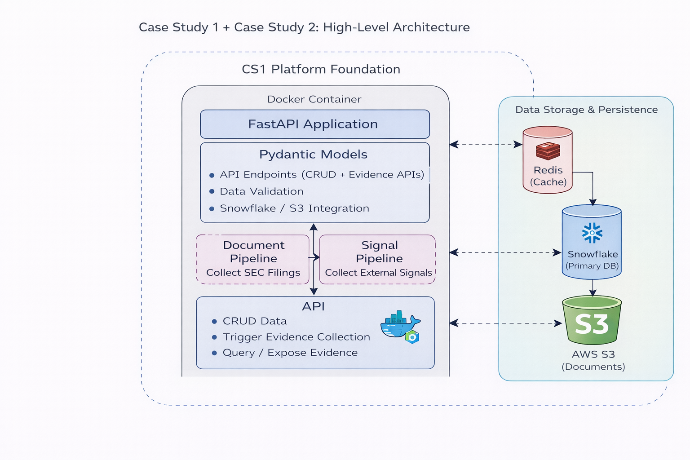

# PE Org-AI-R Platform

An AI-Readiness Assessment Platform for Private Equity organizations. The platform evaluates portfolio companies across seven key AI-readiness dimensions and provides structured assessment workflows for due diligence, screening, portfolio monitoring, and exit preparation.

---

## Link

- FastAPI public URL: http://35.93.9.162:8000/docs
- Demo video link: https://www.youtube.com/watch?v=ATQqYbEYGnM

---

## Architecture Diagram



---

## Directory Structure

```
case_study1/
├── README.md
├── pyproject.toml                  # Poetry config & project metadata
├── poetry.lock                     # Locked dependency versions
├── .gitignore
├── app/
│   ├── __init__.py
│   ├── main.py                     # FastAPI application entry point
│   ├── config.py                   # Pydantic-based settings management
│   ├── database/
│   │   ├── __init__.py
│   │   └── schema.sql              # Snowflake DDL & seed data
│   ├── models/
│   │   ├── __init__.py
│   │   ├── common.py               # Shared response models (pagination, health, errors)
│   │   ├── company.py              # Company & Industry Pydantic models
│   │   ├── assessment.py           # Assessment lifecycle models
│   │   ├── dimension.py            # Dimension score models
│   │   └── enums.py                # Enums: AssessmentType, Status, Dimensions, Weights
│   ├── routers/
│   │   ├── __init__.py
│   │   ├── health.py               # GET /health - dependency health checks
│   │   ├── companies.py            # CRUD endpoints for companies
│   │   ├── assessments.py          # Assessment lifecycle & scoring endpoints
│   │   └── scores.py               # Dimension score update endpoint
│   └── services/
│       ├── __init__.py
│       ├── snowflake.py            # Snowflake database service (queries, writes)
│       ├── redis_cache.py          # Redis caching with TTL & key management
│       └── s3_storage.py           # AWS S3 document storage operations
├── docker/
│   ├── Dockerfile                  # Multi-stage Python 3.11 container build
│   └── docker-compose.yml          # Orchestration for API + Redis services
└── tests/
    ├── __init__.py
    ├── conftest.py                 # Pytest fixtures & mock services
    ├── test_api.py                 # API endpoint integration tests
    └── test_models.py              # Pydantic model validation tests
```

---

## Project Overview

### Purpose

The **PE Org-AI-R Platform** is a backend API designed to help Private Equity firms assess the AI-readiness of their portfolio companies. It provides a structured workflow for creating assessments, scoring companies across seven AI-readiness dimensions, and tracking assessment lifecycles from draft to approval.

### Scope

- **Company Management** -- CRUD operations for portfolio companies with industry classification
- **Assessment Lifecycle** -- State-machine-driven workflow (Draft -> In Progress -> Submitted -> Approved)
- **Dimension Scoring** -- Evaluate companies on 7 AI-readiness dimensions with configurable weights
- **Document Storage** -- Store and retrieve SEC filings, reports, and assessment artifacts via S3
- **Performance Caching** -- Redis-backed caching with dimension-specific TTLs

### Tech Stack

| Layer            | Technology                          | Purpose                                  |
| ---------------- | ----------------------------------- | ---------------------------------------- |
| **Framework**    | FastAPI 0.109 + Uvicorn 0.27        | Async REST API with auto-generated docs  |
| **Language**     | Python 3.11+                        | Core application language                |
| **Database**     | Snowflake                           | Cloud data warehouse for persistent data |
| **Cache**        | Redis 7                             | In-memory caching layer                  |
| **Object Store** | AWS S3                              | Document and artifact storage            |
| **Validation**   | Pydantic 2.5                        | Request/response data validation         |
| **Dependencies** | Poetry                              | Package management and lockfile          |
| **Containers**   | Docker + Docker Compose             | Containerization and orchestration       |
| **Testing**      | Pytest + pytest-asyncio + FakeRedis | Unit and integration testing             |

---

## Step-by-Step Guide

### Prerequisites

- **Python 3.11+**
- **Poetry** (dependency management)
- **Docker & Docker Compose**
- **Snowflake account** (free trial available)
- **AWS account** (for S3, free tier available)

### Step 1: Clone the Repository

```bash
git clone <repository-url>
cd case_study1
```

### Step 2: Install Dependencies

```bash
# Install Poetry if not already installed
curl -sSL https://install.python-poetry.org | python3 -

# Install project dependencies
poetry install
```

### Step 3: Configure Snowflake

1. Sign up at [https://signup.snowflake.com/](https://signup.snowflake.com/) for a free 30-day trial
2. Log in to the Snowflake Web UI and open a new **Worksheet**
3. Execute the following SQL statements step by step:

```sql
-- Create Warehouse and Database
CREATE WAREHOUSE IF NOT EXISTS COMPUTE_WH WITH WAREHOUSE_SIZE = 'XSMALL';
USE WAREHOUSE COMPUTE_WH;
CREATE DATABASE IF NOT EXISTS PE_ORG_AIR;
USE DATABASE PE_ORG_AIR;
USE SCHEMA PUBLIC;
```

```sql
-- Create Tables
CREATE OR REPLACE TABLE industries (
    id VARCHAR(36) PRIMARY KEY,
    name VARCHAR(255) NOT NULL,
    sector VARCHAR(100) NOT NULL,
    h_r_base DECIMAL(5,2),
    created_at TIMESTAMP_NTZ DEFAULT CURRENT_TIMESTAMP()
);

CREATE OR REPLACE TABLE companies (
    id VARCHAR(36) PRIMARY KEY,
    name VARCHAR(255) NOT NULL,
    ticker VARCHAR(10),
    industry_id VARCHAR(36),
    position_factor DECIMAL(4,3) DEFAULT 0.0,
    is_deleted BOOLEAN DEFAULT FALSE,
    created_at TIMESTAMP_NTZ DEFAULT CURRENT_TIMESTAMP(),
    updated_at TIMESTAMP_NTZ DEFAULT CURRENT_TIMESTAMP()
);

CREATE OR REPLACE TABLE assessments (
    id VARCHAR(36) PRIMARY KEY,
    company_id VARCHAR(36) NOT NULL,
    assessment_type VARCHAR(20) NOT NULL,
    assessment_date DATE NOT NULL,
    status VARCHAR(20) DEFAULT 'draft',
    primary_assessor VARCHAR(255),
    secondary_assessor VARCHAR(255),
    v_r_score DECIMAL(5,2),
    confidence_lower DECIMAL(5,2),
    confidence_upper DECIMAL(5,2),
    created_at TIMESTAMP_NTZ DEFAULT CURRENT_TIMESTAMP()
);

CREATE OR REPLACE TABLE dimension_scores (
    id VARCHAR(36) PRIMARY KEY,
    assessment_id VARCHAR(36) NOT NULL,
    dimension VARCHAR(30) NOT NULL,
    score DECIMAL(5,2) NOT NULL,
    weight DECIMAL(4,3),
    confidence DECIMAL(4,3) DEFAULT 0.8,
    evidence_count INT DEFAULT 0,
    created_at TIMESTAMP_NTZ DEFAULT CURRENT_TIMESTAMP()
);
```

```sql
-- Insert Seed Data
INSERT INTO industries (id, name, sector, h_r_base) VALUES
    ('550e8400-e29b-41d4-a716-446655440001', 'Manufacturing', 'Industrials', 72),
    ('550e8400-e29b-41d4-a716-446655440002', 'Healthcare Services', 'Healthcare', 78),
    ('550e8400-e29b-41d4-a716-446655440003', 'Business Services', 'Services', 75),
    ('550e8400-e29b-41d4-a716-446655440004', 'Retail', 'Consumer', 70),
    ('550e8400-e29b-41d4-a716-446655440005', 'Financial Services', 'Financial', 80),
    ('550e8400-e29b-41d4-a716-446655440006', 'Technology', 'Technology', 85),
    ('550e8400-e29b-41d4-a716-446655440007', 'Energy', 'Energy', 68),
    ('550e8400-e29b-41d4-a716-446655440008', 'Real Estate', 'Real Estate', 65);
```

```sql
-- Verify Setup
SELECT * FROM industries;  -- Should show 8 rows
```

### Step 4: Create an S3 Bucket

1. Log in to [AWS Console](https://aws.amazon.com/)
2. Navigate to **S3** and click **"Create bucket"**
3. Set a globally unique bucket name and select your preferred region (e.g., `us-east-1`)
4. Create an **IAM User** with `AmazonS3FullAccess` policy and generate access keys

### Step 5: Configure Environment Variables

Create a `.env` file in the project root:

```bash
# Application Settings
APP_NAME="PE Org-AI-R Platform"
APP_VERSION="1.0.0"
DEBUG=true

# Snowflake Configuration
SNOWFLAKE_ACCOUNT=XXXXX-YYYYY
SNOWFLAKE_USER=your_username
SNOWFLAKE_PASSWORD=your_password
SNOWFLAKE_DATABASE=PE_ORG_AIR
SNOWFLAKE_SCHEMA=PUBLIC
SNOWFLAKE_WAREHOUSE=COMPUTE_WH

# Redis Configuration
REDIS_HOST=localhost       # Use 'redis' if running with docker-compose
REDIS_PORT=6379
REDIS_DB=0

# AWS S3 Configuration
AWS_ACCESS_KEY_ID=your_aws_access_key_id
AWS_SECRET_ACCESS_KEY=your_secret_key
AWS_REGION=us-east-1
S3_BUCKET=your_bucket_name
```

### Step 6: Run the Application

#### Option A: Local Development

```bash
# Start Redis
docker run -d --name redis-local -p 6379:6379 redis:7-alpine

# Start the API server
poetry run uvicorn app.main:app --reload
```

#### Option B: Docker Compose (Recommended)

```bashArchitecture Diagram
cd docker
docker compose --env-file ../.env up --build
```

### Step 7: Verify the Setup

- **Swagger UI**: http://127.0.0.1:8000/docs

### Step 8: Run Tests

```bash
# Run all tests
poetry run pytest

```

---

## API Endpoints

| Method   | Endpoint                          | Description                            |
| -------- | --------------------------------- | -------------------------------------- |
| `GET`    | `/health`                         | Health check for all dependencies      |
| `POST`   | `/api/v1/companies`               | Create a new company                   |
| `GET`    | `/api/v1/companies`               | List companies (paginated, filterable) |
| `GET`    | `/api/v1/companies/{id}`          | Get company by ID                      |
| `PUT`    | `/api/v1/companies/{id}`          | Update a company                       |
| `DELETE` | `/api/v1/companies/{id}`          | Soft-delete a company                  |
| `POST`   | `/api/v1/assessments`             | Create a new assessment                |
| `GET`    | `/api/v1/assessments`             | List assessments (with filters)        |
| `GET`    | `/api/v1/assessments/{id}`        | Get assessment by ID                   |
| `PATCH`  | `/api/v1/assessments/{id}/status` | Update assessment status               |
| `POST`   | `/api/v1/assessments/{id}/scores` | Bulk add dimension scores              |
| `GET`    | `/api/v1/assessments/{id}/scores` | Get assessment dimension scores        |
| `PUT`    | `/api/v1/scores/{id}`             | Update a dimension score               |

---

## Team Member Contributions

| Team Member      | Contributions                                                                                                                                                                                           |
| ---------------- | ------------------------------------------------------------------------------------------------------------------------------------------------------------------------------------------------------- |
| **Nisarg Sheth** | Docker configuration ([Dockerfile](docker/Dockerfile), [docker-compose.yml](docker/docker-compose.yml)) and all test suites ([tests/](tests/))                                                          |
| **Wei Cheng Tu** | API endpoint development ([routers/](app/routers/)) and third-party infrastructure services: S3 ([s3_storage.py](app/services/s3_storage.py)) and Snowflake ([snowflake.py](app/services/snowflake.py)) |
| **Yu Tzu Li**    | Database schema design ([schema.sql](app/database/schema.sql)), Pydantic models ([models/](app/models/)), and application configuration ([config.py](app/config.py))                                    |
